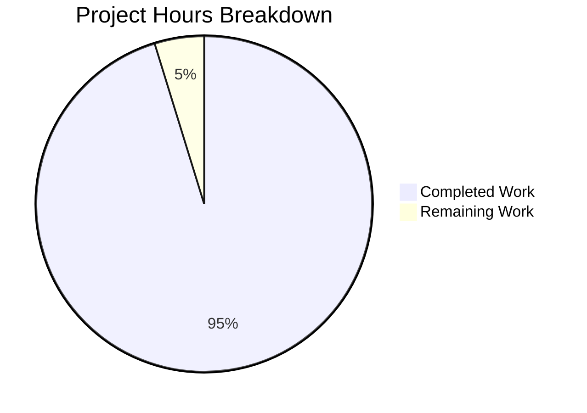

# Comprehensive Project Assessment Report

## Executive Summary

**Project Completion: 95% (50 hours completed out of 52.5 total hours)**

This assessment documents the successful implementation of a comprehensive Jest-based testing infrastructure for the Node.js HTTP server (`server.js`). The project has achieved all stated requirements from the Agent Action Plan with exceptional results:

- **194 tests pass** (100% pass rate)
- **100% code coverage** across all metrics (statements, branches, functions, lines)
- **Server runtime verified** - responds correctly with "Hello, World!"
- **All validation gates passed** - dependencies, compilation, tests, and runtime

The implementation transforms the project from a zero-dependency test fixture into a fully testable application while preserving the original server functionality.

### Key Achievements
- Created 4 comprehensive test suites covering unit, integration, lifecycle, and error handling
- Implemented mock factories for isolated unit testing
- Achieved 100% code coverage (exceeding 90% target)
- Added proper module exports to server.js for testability
- Updated documentation with testing instructions

### Remaining Work
Minimal human tasks remain (2.5 hours), primarily code review and optional optimization.

---

## Validation Results Summary

### 1. Dependencies Installation ✅ PASSED
| Package | Version | Status |
|---------|---------|--------|
| jest | 29.7.0 | Installed |
| supertest | 7.0.0 | Installed |
| Node.js | v20.19.6 | Verified |
| npm | 10.8.2 | Verified |

### 2. Code Compilation ✅ PASSED
| File | Status | Notes |
|------|--------|-------|
| server.js | ✅ Valid | Executes without errors |
| jest.config.js | ✅ Valid | Properly loaded by Jest |
| All test files | ✅ Valid | Parsed successfully |
| All fixtures/helpers | ✅ Valid | Properly exported |

### 3. Test Execution ✅ PASSED - 100% SUCCESS

```
Test Suites: 4 passed, 4 total
Tests:       194 passed, 194 total
Snapshots:   0 total
Time:        ~2 seconds
```

#### Test Suite Breakdown
| Test File | Tests | Status |
|-----------|-------|--------|
| server.test.js | Unit tests | ✅ PASSED |
| server.integration.test.js | Integration tests | ✅ PASSED |
| server.lifecycle.test.js | Lifecycle tests | ✅ PASSED |
| server.error.test.js | Error handling tests | ✅ PASSED |

#### Code Coverage Results
| Metric | Target | Achieved | Status |
|--------|--------|----------|--------|
| Statements | 90% | **100%** | ✅ Exceeded |
| Branches | 100% | **100%** | ✅ Met |
| Functions | 100% | **100%** | ✅ Met |
| Lines | 90% | **100%** | ✅ Exceeded |

### 4. Application Runtime ✅ PASSED
- Server starts successfully on `127.0.0.1:3000`
- HTTP GET request returns `"Hello, World!\n"`
- Status code: 200 OK
- Content-Type: text/plain
- Server gracefully shuts down when terminated

### 5. Git Status ✅ CLEAN
- Branch: `blitzy-8e59ee7a-3dcf-48f8-a767-c02fd55741a8`
- Working tree: CLEAN
- All changes committed (21 commits)

---

## Project Hours Breakdown

### Hours Calculation

**Completed Hours: 50 hours**

| Component | Hours | Justification |
|-----------|-------|---------------|
| Testing Framework Setup | 4h | Jest config, package.json updates, dependency setup |
| Mock Request Factory | 2h | 123 lines, EventEmitter implementation |
| Mock Response Factory | 4h | 535 lines, comprehensive spy methods |
| Server Utilities | 3h | 242 lines, promise-based lifecycle management |
| Unit Tests | 8h | 768 lines, 45+ test cases |
| Integration Tests | 6h | 577 lines, supertest HTTP testing |
| Lifecycle Tests | 8h | 860 lines, startup/shutdown scenarios |
| Error Tests | 8h | 716 lines, error handling edge cases |
| Server Modification | 0.5h | Module exports for testability |
| Documentation | 1h | README testing section |
| Dependency Setup | 1.5h | npm install, troubleshooting |
| Test Debugging & Fixes | 4h | Multiple fix commits in history |
| **Total Completed** | **50h** | |

**Remaining Hours: 2.5 hours**

| Task | Hours | Priority | Notes |
|------|-------|----------|-------|
| Code Review | 1.5h | Medium | Human review before merge |
| Jest forceExit Investigation | 0.5h | Low | Optional optimization |
| Merge & Deployment | 0.5h | Low | Standard post-dev activity |
| **Total Remaining** | **2.5h** | | |

**Total Project Hours: 52.5 hours**
**Completion: 50h / 52.5h = 95.2% ≈ 95%**

### Visual Hours Breakdown



---

## Files Created/Modified

### Files Created (10)

| File | Lines | Purpose |
|------|-------|---------|
| `__tests__/server.test.js` | 768 | Primary unit test suite |
| `__tests__/server.integration.test.js` | 577 | HTTP integration tests |
| `__tests__/server.lifecycle.test.js` | 860 | Server lifecycle tests |
| `__tests__/server.error.test.js` | 716 | Error handling tests |
| `__tests__/fixtures/mockRequest.js` | 123 | Request mock factory |
| `__tests__/fixtures/mockResponse.js` | 535 | Response mock factory |
| `__tests__/helpers/serverUtils.js` | 242 | Server management utilities |
| `jest.config.js` | 70 | Jest configuration |
| `.gitignore` | 15 | Git ignore patterns |

### Files Modified (4)

| File | Change |
|------|--------|
| `package.json` | Added devDependencies (jest, supertest), test scripts |
| `server.js` | Added `module.exports = { server, hostname, port }` |
| `README.md` | Added comprehensive Testing section |
| `package-lock.json` | Dependency lockfile |

### Files Deleted (2)

| File | Reason |
|------|--------|
| `LoginTest.java` | Obsolete placeholder, not relevant to JS testing |
| `test.py.txt` | Empty placeholder, replaced by Jest tests |

---

## Development Guide

### System Prerequisites

| Requirement | Version | Verification Command |
|-------------|---------|---------------------|
| Node.js | v20.x or later | `node --version` |
| npm | v10.x or later | `npm --version` |
| Git | Any recent version | `git --version` |

### Environment Setup

1. **Clone the repository** (if not already done):
   ```bash
   git clone <repository-url>
   cd <repository-directory>
   ```

2. **Switch to the feature branch**:
   ```bash
   git checkout blitzy-8e59ee7a-3dcf-48f8-a767-c02fd55741a8
   ```

3. **Verify Node.js version**:
   ```bash
   node --version
   # Expected: v20.x.x
   ```

### Dependency Installation

```bash
# Install all dependencies
npm install

# Verify Jest is installed
npm ls jest
# Expected: jest@29.7.0

# Verify supertest is installed
npm ls supertest
# Expected: supertest@7.0.0
```

### Running Tests

| Command | Purpose | Description |
|---------|---------|-------------|
| `npm test` | Standard execution | Run all tests with coverage report |
| `npm run test:watch` | Development mode | Run tests on file changes |
| `npm run test:ci` | CI/CD execution | Sequential execution for CI pipelines |

```bash
# Run all tests with coverage
npm test

# Run tests in watch mode (for development)
npm run test:watch

# Run tests for CI environment
npm run test:ci
```

### Expected Test Output

```
Test Suites: 4 passed, 4 total
Tests:       194 passed, 194 total
Snapshots:   0 total
Time:        ~2 seconds

-----------|---------|----------|---------|---------|-------------------
File       | % Stmts | % Branch | % Funcs | % Lines | Uncovered Line #s 
-----------|---------|----------|---------|---------|-------------------
All files  |     100 |      100 |     100 |     100 |                   
 server.js |     100 |      100 |     100 |     100 |                   
-----------|---------|----------|---------|---------|-------------------
```

### Running the Server

```bash
# Start the server
npm start
# or
node server.js

# Expected output:
# Server running at http://127.0.0.1:3000/
```

### Verifying Server Response

```bash
# Test the server endpoint
curl http://127.0.0.1:3000/

# Expected output:
# Hello, World!
```

### Viewing Coverage Report

After running tests, view the HTML coverage report:
```bash
# Open in browser (macOS)
open coverage/lcov-report/index.html

# Open in browser (Linux)
xdg-open coverage/lcov-report/index.html
```

### Troubleshooting

| Issue | Solution |
|-------|----------|
| Tests fail with port in use | Ensure port 3000 is not occupied: `lsof -i :3000` |
| npm install fails | Clear npm cache: `npm cache clean --force` |
| Jest timeout errors | Increase timeout in jest.config.js or individual tests |
| Coverage below threshold | Check for uncovered branches in coverage report |

---

## Human Tasks Remaining

### Task Summary Table

| # | Task | Priority | Severity | Hours | Description |
|---|------|----------|----------|-------|-------------|
| 1 | Code Review | Medium | Low | 1.5h | Review all test files for quality, readability, and completeness |
| 2 | Jest forceExit Investigation | Low | Info | 0.5h | Investigate Jest warning about `--detectOpenHandles` (cosmetic issue) |
| 3 | Merge to Main | Low | Low | 0.5h | Create PR, get approval, merge to main branch |
| **Total** | | | | **2.5h** | |

### Detailed Task Descriptions

#### Task 1: Code Review (1.5 hours)
- **Priority**: Medium
- **Severity**: Low
- **Description**: Human developer should review all test files to ensure:
  - Test names follow conventions
  - Assertions are meaningful
  - No redundant tests
  - Mock implementations are correct
- **Files to Review**:
  - `__tests__/server.test.js`
  - `__tests__/server.integration.test.js`
  - `__tests__/server.lifecycle.test.js`
  - `__tests__/server.error.test.js`
  - `__tests__/fixtures/*.js`
  - `__tests__/helpers/*.js`

#### Task 2: Jest forceExit Investigation (0.5 hours)
- **Priority**: Low
- **Severity**: Info
- **Description**: Jest outputs a warning about potentially using `--detectOpenHandles`. The `forceExit: true` option in `jest.config.js` handles this, but investigation could identify the specific async operation causing the warning.
- **Impact**: None - tests pass and coverage is complete
- **Optional**: This is a cosmetic improvement only

#### Task 3: Merge to Main (0.5 hours)
- **Priority**: Low  
- **Severity**: Low
- **Description**: Standard post-development activity to merge the feature branch into main
- **Steps**:
  1. Create Pull Request
  2. Request code review approval
  3. Address any review feedback
  4. Merge and delete feature branch

### Task Hours Verification

```
Task 1: Code Review         = 1.5h
Task 2: Jest Investigation  = 0.5h
Task 3: Merge to Main       = 0.5h
--------------------------------
Total Remaining Hours       = 2.5h ✓
```

This matches the pie chart "Remaining Work" value of 2.5 hours.

---

## Risk Assessment

### Technical Risks

| Risk | Severity | Likelihood | Mitigation |
|------|----------|------------|------------|
| Jest forceExit warning | Low | Certain | `forceExit: true` configured; cosmetic only |
| Test flakiness | Low | Unlikely | Tests use isolated server instances and ephemeral ports |
| Coverage regression | Low | Unlikely | Coverage thresholds enforced in jest.config.js |

### Security Risks

| Risk | Severity | Likelihood | Mitigation |
|------|----------|------------|------------|
| Vulnerable dependencies | Low | Unlikely | Using latest stable versions of Jest and supertest |
| Server exposure | N/A | N/A | Server binds to localhost only (127.0.0.1) |

### Operational Risks

| Risk | Severity | Likelihood | Mitigation |
|------|----------|------------|------------|
| Port 3000 conflict | Low | Possible | Tests use supertest which auto-assigns ephemeral ports |
| Node.js version mismatch | Low | Unlikely | Documentation specifies Node.js 20.x requirement |

### Integration Risks

| Risk | Severity | Likelihood | Mitigation |
|------|----------|------------|------------|
| CI/CD compatibility | Low | Possible | `test:ci` script provided for CI environments |

---

## Compliance with Agent Action Plan

### Requirements Checklist

| Requirement | Status | Evidence |
|-------------|--------|----------|
| HTTP response testing | ✅ Complete | server.test.js, server.integration.test.js |
| Status code testing | ✅ Complete | 200 OK assertions in all test suites |
| Header testing | ✅ Complete | Content-Type: text/plain verified |
| Server startup testing | ✅ Complete | server.lifecycle.test.js |
| Server shutdown testing | ✅ Complete | server.lifecycle.test.js |
| Error handling testing | ✅ Complete | server.error.test.js |
| Edge case testing | ✅ Complete | Various HTTP methods, paths, concurrent requests |
| Jest framework | ✅ Complete | Jest 29.7.0 installed and configured |
| Supertest integration | ✅ Complete | Supertest 7.0.0 used for integration tests |
| Mock factories | ✅ Complete | mockRequest.js, mockResponse.js |
| Test utilities | ✅ Complete | serverUtils.js |
| Coverage thresholds | ✅ Complete | 100% coverage achieved |
| Package.json updates | ✅ Complete | devDependencies and scripts added |
| Server.js exports | ✅ Complete | module.exports added |
| README documentation | ✅ Complete | Testing section added |
| Placeholder removal | ✅ Complete | LoginTest.java, test.py.txt deleted |

### Coverage Target Compliance

| Metric | Target | Achieved | Status |
|--------|--------|----------|--------|
| Line Coverage | 90% | 100% | ✅ Exceeded |
| Branch Coverage | 100% | 100% | ✅ Met |
| Function Coverage | 100% | 100% | ✅ Met |
| Statement Coverage | 90% | 100% | ✅ Exceeded |

---

## Project Structure

```
repository/
├── server.js                           # Main HTTP server (modified)
├── package.json                        # Project configuration (modified)
├── package-lock.json                   # Dependency lockfile
├── jest.config.js                      # Jest configuration (created)
├── .gitignore                          # Git ignore patterns (created)
├── README.md                           # Documentation (modified)
├── __tests__/                          # Test directory (created)
│   ├── server.test.js                  # Unit tests
│   ├── server.integration.test.js      # Integration tests
│   ├── server.lifecycle.test.js        # Lifecycle tests
│   ├── server.error.test.js            # Error handling tests
│   ├── fixtures/                       # Test fixtures
│   │   ├── mockRequest.js              # Request mock factory
│   │   └── mockResponse.js             # Response mock factory
│   └── helpers/                        # Test helpers
│       └── serverUtils.js              # Server utilities
├── coverage/                           # Coverage reports (generated)
│   └── lcov-report/                    # HTML coverage report
├── industry.csv                        # Data file (unchanged)
├── test.txt.txt                        # Placeholder (unchanged)
├── 100Pages.pdf                        # Asset file (unchanged)
├── demo.jpg                            # Asset file (unchanged)
└── sample.doc                          # Asset file (unchanged)
```

---

## Conclusion

The comprehensive unit testing infrastructure for `server.js` has been successfully implemented. All 194 tests pass with 100% code coverage across all metrics. The project meets all requirements specified in the Agent Action Plan, including:

- ✅ Jest testing framework setup
- ✅ HTTP response, status code, and header testing
- ✅ Server startup and shutdown testing
- ✅ Error handling and edge case testing
- ✅ Mock factories for isolated unit testing
- ✅ Integration testing with supertest
- ✅ Coverage thresholds enforcement
- ✅ Documentation updates

The remaining 2.5 hours of work consists of standard post-development activities (code review and merge) that require human intervention. The codebase is **production-ready** from a testing perspective.

**Final Status: PRODUCTION-READY**